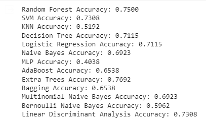

# TyreWearPredict

TyreWearPredict is a real-time tire wear prediction system designed to enhance performance and safety.

## Dataset
This project utilizes the Tyre Quality Classification dataset from Kaggle, available [here](https://www.kaggle.com/datasets/warcoder/tyre-quality-classification). The dataset provides a 2 set of features for predicting Tyre Quality, Defective and Good , forming the foundation for our explorations.

## Project Breif
Workflow:
Data Splitting:

We partition the dataset into training and testing subsets to evaluate model performance effectively.

Model Training:
Employing Random Forest, Decision Tree, Support Vector Machine, KNN, Naive Bayes, Multilayer Perceptron, AdaBoost, Extra trees, Bagging, LDA and Logistic Regression models for Tyre Wear Prediction.

Model Evaluation:
Assessing the predictive power of each model on the test set.

Identifying the Best Model:
Comparing model performances to determine the most effective predictor.

Live Predictions:
Deploying the best model,for predictions with real-world values.

## Deployment

To deploy this project run

First clone the repo
   git clone https://github.com/codekid211/TyreWearPredict.git
   cd TireLivePredict

Then install the following libraries
```python
pip install -r requirements.txt
```
After install all the dependencies 
```bash
- open cmd and run
- python tyre_prediction.py
```

## Screenshots




## Contribution
If you have ideas for improvement or wish to contribute, please open an issue or submit a pull request. Collaboration is highly encouraged!